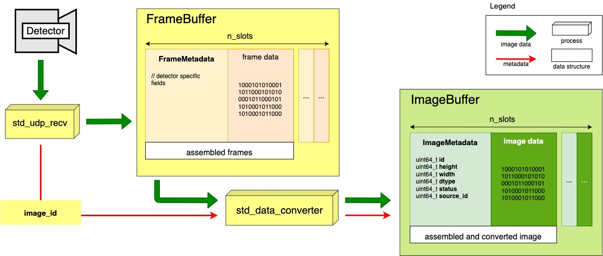

# Detectors

## Integration of a new detector

In this chapter we will lay out one procedure that could be followed to integrate a new detector into the standard daq. 
The integration can be done on 3 levels, and this guide should cover all of them.

### Architectural overview

The data first need to be received from the network. This is done in the **std\_udp\_recv** service. This service 
receives an input stream (of UDP packets, usually) from a single detector module and assembles the packets into 
detector frames (frame in this context means the image part coming from a single detector module). The frame and its 
metadata are then stored into the FrameBuffer (RamBuffer instance containing frames). In addition, the service also 
publishes all the assembled frames on a ZMQ socket (sending only the assembled image_id).

After having received the same image_id via ZMQ from all active receivers, the **std\_data\_converter** assembles the 
individual frames into images, taking care of data conversion if needed, calculates the ImageMetadata fields from the
received FrameMetadata-s, and stores the result into the ImageBuffer (RamBuffer instance containing images).

From the ImageBuffer on we have standard services that can be used to save images to files, stream them to other 
machines and make them available to other external processes.

You can integrate a detector into the standard_daq on 3 levels:

- You can write your own UDP receivers.
- You can write your own data converters.
- You can push data directly into the ImageBuffer.

### Receiving data from a detector - writing your own UDP receivers

This step usually needs to be done only for new detectors. The currently supported detectors are:

- Jungfrau
- Eiger
- Gigafrost

Since the receivers have no logic inside (accumulate packets and construct frames) they can be reused in almost 
any scenario. Probably the only exception is when the performance of the standard UDP receivers is not good enough, 
and you need a custom solution. Here we will assume you have a new detector, and you need to do everything from scratch.

The procedure below can be followed as a step-by-step guide that includes:

- Dumping the UDP stream coming from the detector to files.
- Writing a packet analyzer to characterize the UDP packets and verify that the provided detector documentation is correct.
- Write a detector simulator that generates the correct UDP packets and validate them by comparing them with the dumped 
packets from the detector.
- Based on the UDP packet analyzer data and detector documentation implement the first version of your UDP receivers.
- Implement integration tests with the detector simulator and udp receivers.
- Performance test your UDP receivers on the real detector. 

### Converting frames into images

### Pushing data into the image buffer